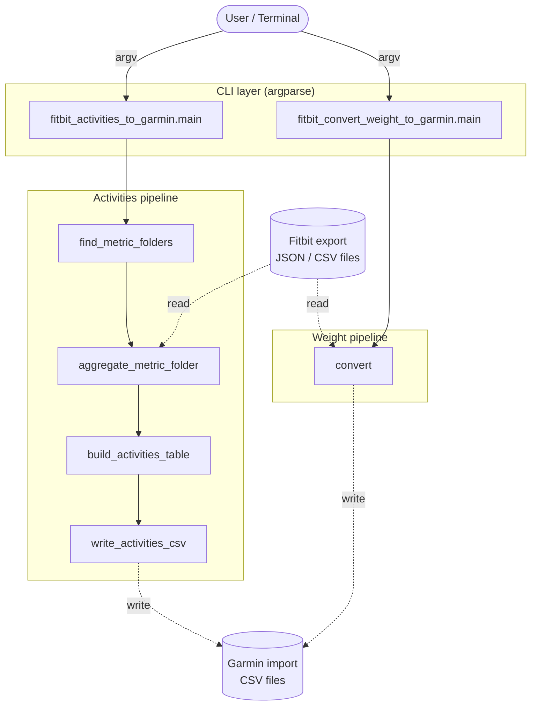

# Architecture

> **Scope note.** The reference architecture in the build standard
> (Browser → Vercel Edge Middleware → SvelteKit → Python API → PostgreSQL) does
> not apply to this project. FitBit2Garmin is **not** a web application: it has
> no browser frontend, no edge middleware, no long-running API service, and no
> database. It is a pair of stateless, offline command-line scripts that
> transform local files. The web/database tiers are therefore documented as
> **Not Applicable** below, and the diagram reflects the system as actually
> built.

## Conceptual component diagram

Not-applicable reference components (no code exists for these): Browser UI,
Vercel Edge Middleware, SvelteKit frontend, hosted Python API service,
PostgreSQL, agent/worker processes.

## Tier descriptions

| Tier | Owns | Does **not** own |
| --- | --- | --- |
| **CLI layer** (`main` in each script) | Argument parsing/validation, timezone selection, top-level orchestration, console reporting | Any file parsing logic or output formatting |
| **Activities pipeline** | Folder discovery, per-metric aggregation, cross-metric merge, per-year CSV emission | Argument parsing; weight data |
| **Weight pipeline** (`convert`) | Reading the weight CSV, unit/date transforms, Garmin `Body` CSV emission | Activity metrics; timezone conversion (deliberately none) |
| **Filesystem (input)** | The user-supplied Fitbit export (read-only to the scripts) | Anything the scripts produce |
| **Filesystem (output)** | Generated Garmin-format CSVs | Source data integrity |

## Communication paths

All inter-component communication is **in-process function calls** and **local
filesystem I/O**. There are no HTTP calls, no database connections, no polling,
and no event/message buses.

| Link | Mechanism |
| --- | --- |
| User → CLI | Process `argv` (command-line arguments) |
| CLI → pipeline functions | Synchronous Python function calls |
| Pipeline → input files | Blocking filesystem reads (`open`, `json.load`, `csv.DictReader`) |
| Pipeline → output files | Blocking filesystem writes (text/CSV) |
| CLI → user | `print` to stdout; non-zero `sys.exit` on fatal errors |

## Standards applied

- **No REST / HTTP** — not a networked service; HTTP status codes are not used.
- **Authentication:** none (operates only on local files the user already owns).
- **Data formats — input:** Fitbit JSON (`[{"dateTime","value"}]`) and Fitbit
  CSV/TSV (auto-detected delimiter; case-insensitive column matching).
- **Data formats — output:** Garmin Connect import CSV. Activities files carry a
  literal `Activities` title line + header row; weight files carry a literal
  `Body` title line + header row (both required by Garmin's importer).
- **Timestamps:** Fitbit timestamps treated as UTC; activities pipeline converts
  to a configurable IANA timezone (`zoneinfo`) before bucketing by calendar day.
  Weight pipeline keeps the UTC calendar date with no conversion (by design).
- **Exit codes:** `0` success; `1` on bad arguments, invalid timezone, or
  missing input directory.

## Code function inventory

### `fitbit_activities_to_garmin.py`

| Function | Responsibility (one line) |
| --- | --- |
| `normalize(name)` | Strip a folder/column name to lowercase alphanumerics for fuzzy matching. |
| `find_metric_folders(export_folder)` | Recursively walk the export and map each known metric to matching folder(s). |
| `parse_day_any_format(raw)` | Convert any Fitbit timestamp (JSON or `...Z` CSV) to `YYYY-MM-DD` in the local timezone, treating the source as UTC. |
| `find_key(d, candidates)` | Return the first record key matching a candidate name, case-insensitively. |
| `read_json_records(file_path)` | Load a Fitbit JSON file, normalizing a single-object payload into a list. |
| `read_csv_records(file_path)` | Load a CSV/TSV file, auto-detecting tab vs. comma delimiter. |
| `aggregate_metric_folder(folders, metric_name)` | Read every file for one metric and sum values per day. |
| `build_activities_table(export_folder)` | Discover, aggregate, and merge all metrics into a date-keyed Garmin table (with unit conversion and 0-fill defaults). |
| `write_activities_csv(table, output_dir)` | Write the table to `Activities_<year>.csv` files in Garmin's format. |
| `main()` | Parse CLI args, validate timezone/paths, run the pipeline, print guidance. |

### `fitbit_convert_weight_to_garmin.py`

| Function | Responsibility (one line) |
| --- | --- |
| `convert(infile, outfile)` | Read the Fitbit weight CSV and write a Garmin `Body` CSV (date reformat, grams→kg, zero-filled BMI/Fat). |
| `__main__` block | Validate the two CLI arguments and invoke `convert`. |

## Data flow narrative

**Activities — single invocation, end to end:**

1. The user runs `python fitbit_activities_to_garmin.py <export> <out> [--timezone TZ]`.
2. `main()` parses arguments, resolves the IANA timezone into `LOCAL_TZ`
   (exiting `1` if invalid), and verifies `<export>` is a directory.
3. `build_activities_table()` calls `find_metric_folders()`, which recursively
   scans subfolders and fuzzy-matches each to a known metric (warning on misses).
4. For each metric, `aggregate_metric_folder()` reads every JSON/CSV file,
   detects the time/value columns and CSV delimiter, converts each timestamp to
   a local calendar day via `parse_day_any_format()`, and sums values per day.
   Malformed files/rows are skipped with warnings.
5. The per-metric daily totals are merged over the **union** of all dates,
   distance is converted meters→km, missing metrics default to `0`, and
   `Activity Calories` falls back to `Calories Burned`.
6. `write_activities_csv()` splits the table by year and writes one
   `Activities_<year>.csv` (title line + header + quoted rows) per year.
7. `main()` prints completion guidance (spot-check reminder).

There are **no asynchronous steps** — the entire run is synchronous and
single-threaded.

**Weight — single invocation:** `convert()` reads the input CSV row by row,
reformats each `timestamp` to `M/D/YYYY` (no timezone conversion), converts
`weight grams`→kilograms (2 dp), appends `BMI=0`/`Fat=0`, drops `data source`,
and writes a `Body`-prefixed CSV. Fully synchronous.
