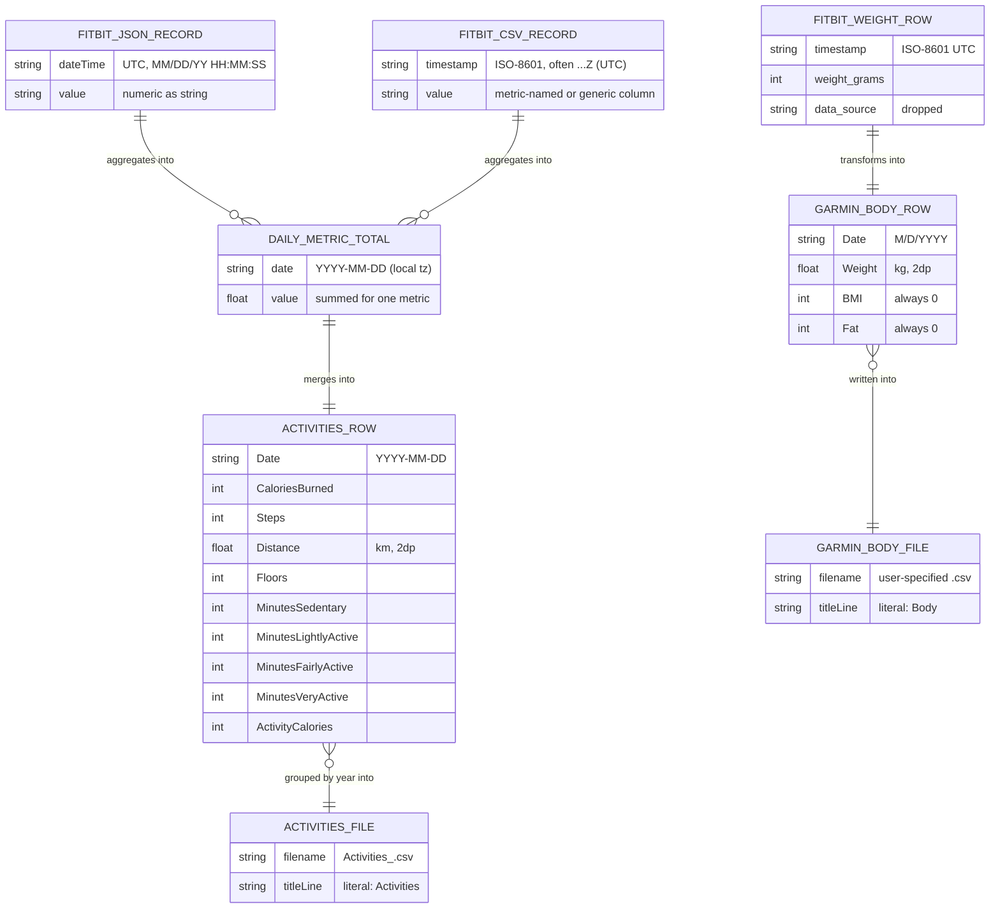

# Schema

> **Scope note.** This project has **no database**. It is a stateless file
> converter with no persistence layer, no ORM, no migrations, and no EMC
> (Expand-Migrate-Contract) cycle. The standard's required items — `erDiagram`,
> table/column reference, enums, indexes, triggers/stored functions, migration
> history, and EMC cycle status — are therefore **Not Applicable**; each is
> listed as such at the end with rationale.
>
> To remain useful, this document instead specifies the **data structures and
> file formats** the scripts read and write — the closest analog to a schema for
> a converter of this kind.

## Logical data model

The diagram below shows the in-memory and on-disk structures (rendered as an
`erDiagram` for compatibility with the standard's tooling — these are data
shapes, not SQL tables).

## Structure-by-structure reference

### Input — Fitbit JSON record
| Field | Type | Constraints | Description |
| --- | --- | --- | --- |
| `dateTime` | string | `MM/DD/YY HH:MM:SS`, treated as UTC | Reading timestamp. |
| `value` | string | parseable as float | Metric reading; rows that fail to parse are skipped. |

### Input — Fitbit activities CSV record
| Field | Type | Constraints | Description |
| --- | --- | --- | --- |
| time column | string | name in {`timestamp`,`datetime`,`date`}, case-insensitive | ISO-8601, often `...Z` (UTC). |
| value column | string | metric-named (e.g. `distance`) or generic `value` | Metric reading. Delimiter auto-detected (tab/comma). |

### Input — Fitbit weight CSV record
| Field | Type | Constraints | Description |
| --- | --- | --- | --- |
| `timestamp` | string | ISO-8601 UTC, optional fractional seconds | Weigh-in time. |
| `weight grams` | number | parseable as float | Weight in grams. |
| `data source` | string | — | Ignored/dropped on output. |

### Output — Garmin Activities row
| Column | Type | Constraints | Description |
| --- | --- | --- | --- |
| `Date` | string | `YYYY-MM-DD`, quoted | Local calendar day. |
| `Calories Burned` | int | ≥0 | Summed calories, rounded. |
| `Steps` | int | ≥0 | Summed steps. |
| `Distance` | float | 2 dp | Kilometres (meters ÷1000 — assumption). |
| `Floors` | int | ≥0 | Summed floors. |
| `Minutes Sedentary` | int | ≥0 | 0 if folder absent. |
| `Minutes Lightly Active` | int | ≥0 | 0 if folder absent. |
| `Minutes Fairly Active` | int | ≥0 | 0 if folder absent. |
| `Minutes Very Active` | int | ≥0 | 0 if folder absent. |
| `Activity Calories` | int | ≥0 | Falls back to `Calories Burned`. |

File convention: one file per year, `Activities_<year>.csv`, beginning with a
literal `Activities` line, then the header row, then quoted data rows.

### Output — Garmin Body (weight) row
| Column | Type | Constraints | Description |
| --- | --- | --- | --- |
| `Date` | string | `M/D/YYYY` (no zero-padding) | UTC calendar date, no tz conversion. |
| `Weight` | float | 2 dp | Kilograms. |
| `BMI` | int | always `0` | Not in source; required by Garmin. |
| `Fat` | int | always `0` | Not in source; required by Garmin. |

File convention: single CSV beginning with a literal `Body` line, then the
header row, then data rows.

## Enumerated value sets (configuration, not DB enums)

These are the fixed alias/column vocabularies the activities script matches
against (defined as module constants, not database enums):

- **Metric keys:** `steps`, `calories`, `distance`, `floors`,
  `minutes_sedentary`, `minutes_lightly_active`, `minutes_fairly_active`,
  `minutes_very_active`, `activity_calories`.
- **Fairly-active aliases:** `minutesfairlyactive`, `minutesmoderatelyactive`.
- **Time-column hints:** `timestamp`, `datetime`, `date`.

## Not Applicable (with rationale)

| Standard requirement | Status | Rationale |
| --- | --- | --- |
| `erDiagram` of a relational database | N/A | No database; the diagram above models data shapes instead. |
| Indexes & their purpose | N/A | No database/indexes. |
| Triggers & stored functions | N/A | No database; all logic is in the Python scripts. |
| Migration History (`database/migrations/`) | N/A | No `database/migrations/` directory exists; nothing to migrate. |
| EMC Cycle Status | N/A | No persistence layer, so no Expand-Migrate-Contract cycle is or can be in progress. |
